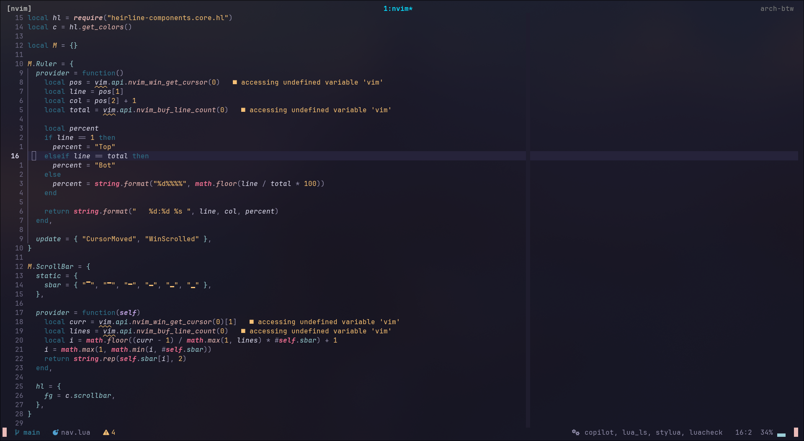

# 💤 NEOVIM


## 🧰 Requirements

- Neovim ≥ 0.9.0  
- Node.js ≥ 16 (JS/TS tools)  
- Python ≥ 3.8 (Python LSPs/formatters)  
- Lua 5.1+  
- ripgrep (`rg`)  
- PHP ≥ 8.0 (for phpactor or intelephense)

---


## 🚀 Installation

1. **Clone neovim:**

   ```bash
   git clone https://github.com/kuzanf3b/nvim.conf ~/.config/nvim
   ```

2. **Enter config directory:**

   ```bash
   cd ~/.config/nvim
   ```

2. **Open Neovim and Lazy.nvim will automatically install plugins:**

   ```bash
   nvim
   ```
---

## 🔑 Mappings Overview

|Mode     | Key          | Action |
|---------|--------------|--------|
|`n`      | `<leader>ff` | Find files |
|`n`      | `<leader>fg` | Live grep |
|`n`      | `<leader>a`  | Add file to harpoon |
|`n`      | `<C-e>`      | Harpoon menu |
|`n`      | `<leader>e`  | Toggle explorer |
|`n`, `v` | `<leader>ca` | Code action |
|`n`      | `gd`         | Go to definition |
|`n`      | `<leader>u`  | Toggle undo history |
|`n`      | `<leader>cp` | Toggle Copilot |

---

## 🖱️ Screenshots


