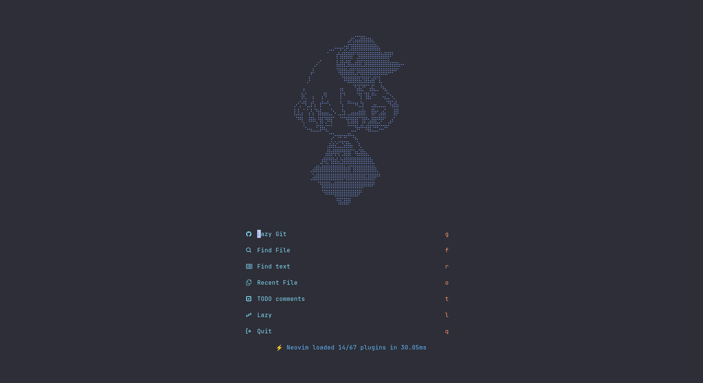
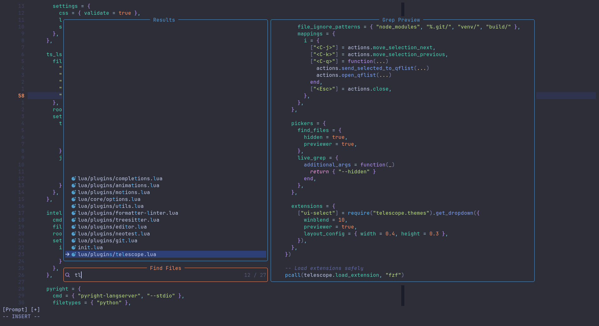
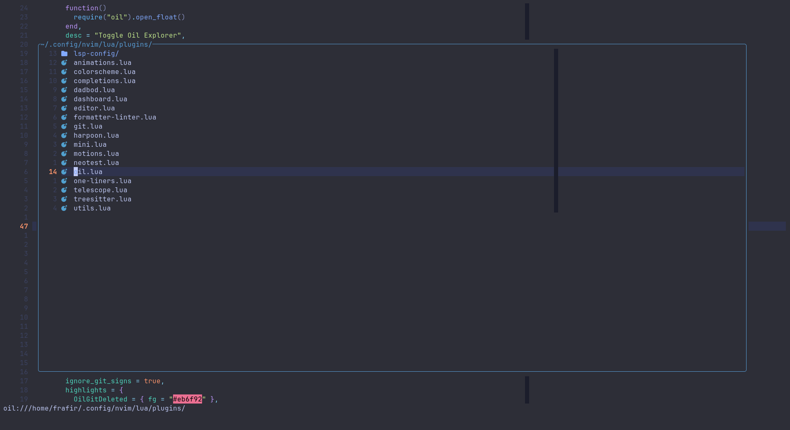
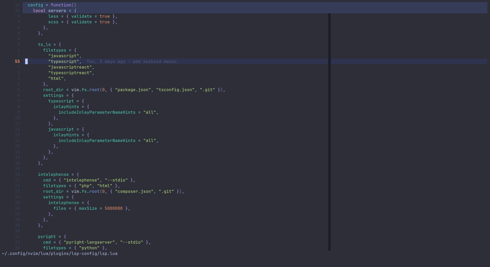

# 💤 ZenVim

[](https://neovim.io/)
[](https://www.lua.org/)
[](https://github.com/folke/lazy.nvim)

## ✨ Overview 
ZenVim is a thoughtfully curated Neovim configuration built manually from the ground up. It embraces minimalism, efficiency, and clarity — for devs who want their editor to feel alive yet streamlined.  
This isn’t just a copy‑paste config; it’s a handcrafted setup for those who code, engineer and live in the zone.

---

## 🧰 Requirements

- Neovim ≥ 0.9.0  
- Node.js ≥ 16 (JS/TS tools)  
- Python ≥ 3.8 (Python LSPs/formatters)  
- Lua 5.1+  
- ripgrep (`rg`)  
- PHP ≥ 8.0 (for phpactor or intelephense)

---


## 🚀 Installation

1. **Clone ZenVim:**

   ```bash
   git clone https://github.com/kuzanf3b/ZenVim ~/.config/nvim
   ```

2. **Enter config directory:**

   ```bash
   cd ~/.config/nvim
   ```

2. **Open Neovim and Lazy.nvim will automatically install plugins:**

   ```bash
   nvim
   ```
---

## 🔑 Mappings Overview

| Key          | Action |
|--------------|--------|
| `<leader>ff` | Find files |
| `<leader>fg` | Live grep |
| `<leader>a`  | Add file to harpoon |
| `<C-e>`      | Harpoon menu |
| `<leader>e`  | Toggle Oil explorer |
| `<leader>ca` | Code action |
| `gd`         | Go to definition |
| `<leader>u`  | Toggle undo history |
| `<leader>cp` | Toggle Copilot |

---

## 🧩 Folder Structure

```
~/.config/nvim
├── init.lua
├── after
│   └── ftplugin
│       └── netrw.lua
├── lua
│   ├── core
│   │   ├── abbrev.lua
│   │   ├── autocmds.lua
│   │   ├── lazy.lua
│   │   ├── mappings.lua
│   │   └── options.lua
│   └── plugins
│       │   └── lsp-config/
│       │       ├── lsp.lua
│       │       └── mason.lua
│       ├── autopairs.lua
│       ├── blink.lua
│       ├── colorscheme.lua
│       ├── copilot.lua
│       ├── formatter-linter.lua
│       ├── gitsigns.lua
│       ├── harpoon.lua
│       ├── heirline.lua
│       ├── leap.lua
│       ├── mini.lua
│       ├── neotest.lua
│       ├── oil.lua
│       ├── one-liners.lua
│       ├── peek.lua
│       ├── presence.lua
│       ├── quicker.lua
│       ├── telescope.lua
│       ├── todo-comments.lua
│       ├── treesitter.lua
│       ├── trouble.lua
│       └── ui.lua
└── README.md
```

<!-- --- -->
<!---->
<!-- ## 🖱️ Screenshots -->
<!---->
<!-- | **Dashboard** | **Telescope** | -->
<!-- |-----------|-----------| -->
<!-- |  |  |  -->
<!---->
<!-- | **Oil** | **Coding** | -->
<!-- |-----------|-----------| -->
<!-- |  |  | -->

---

## 🤝 Contributions

Contributions are always welcome!

Whether it's bug reports, feature requests, or pull requests, please feel free to open an issue or PR.

1.  Fork the repository.
2.  Create your feature branch (`git checkout -b feature/AmazingFeature`).
3.  Commit your changes (`git commit -m 'Add some AmazingFeature'`).
4.  Push to the branch (`git push origin feature/AmazingFeature`).
5.  Open a Pull Request.
